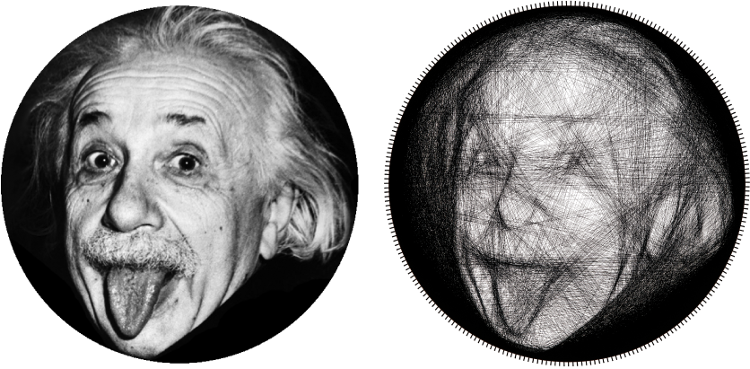
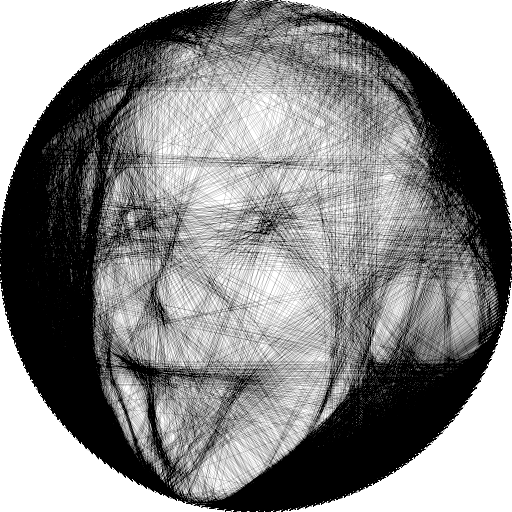
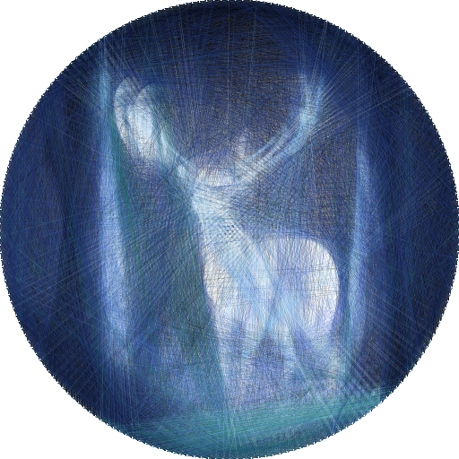

# 3D and Multicolor Computational String Art

Extensions to computational string art: **3D voxel reconstruction**, **multicolor layered and unified pipelines**, **automated palette selection**, and **GPU-accelerated optimization**. Builds on [*String Art: Towards Computational Fabrication of String Images*](https://www.cg.tuwien.ac.at/research/publications/2018/Birsak2018-SA/) (Birsak et al., Eurographics 2018) — [project page](https://www.cg.tuwien.ac.at/research/publications/2018/Birsak2018-SA/) · [video](https://www.cg.tuwien.ac.at/research/publications/2018/Birsak2018-SA/Birsak2018-SA-video.mp4).

---

## Key additions beyond Birsak et al. (2018)

- **GPU-accelerated greedy optimization** (PyTorch / CuPy)
- **Automated color selection** for multicolor (greedy palette from B&W; choose colors that minimize total dithering distance)
- **Multicolor pipelines**: layered (independent L2 per color) and **unified** (joint color+edge selection; each string depends on current image)
- **3D voxel reconstruction** using cubic pin frames
- **Chamfer-based surface optimization** for 3D targets
- **Unified Python CLI** for 2D, multicolor, and 3D pipelines

---

## Example Input and Output



---

## Results (this implementation)

*Code will be released upon publication. Below are example outputs from the extended pipeline.*

| 2D monochrome | Multicolor (Floyd–Steinberg + per-color layers) | 3D (sphere on cubic frame) |
|---------------|--------------------------------------------------|----------------------------|
|  |  |  |

**Videos**

- **2D timelapse:** [Einstein — adding each string one-by-one](images/einstein%20string%20art.mp4)
- **3D 360°:** [Torus reconstruction](images/torus%20string%20art.mp4)

### Method overview

This implementation extends the original monocolor string art formulation with multicolor and 3D variants.

**Multicolor:** We use automated palette selection (greedy over color space), then either a *layered* pipeline (independent optimization per color + compositing) or a *unified* pipeline (joint color and edge selection at each step). Floyd–Steinberg dithering maps the image to the palette.

**3D:** Pins lie on the edges of a cubic frame; the target is a voxel surface (e.g. sphere or torus). We provide two optimizers: **greedy voxel L2** (minimize voxel reconstruction error) and **Chamfer (T→R)** (minimize distance from target surface to string samples). Greedy voxel L2 is the default for typical surface targets.

Full algorithm details (objectives, update rules, and complexity) will be given in the accompanying paper.

---

## Repository overview

The codebase includes the original MATLAB implementation plus the Python extensions above.

### Quick Start (Python)

```bash
pip install -r requirements.txt
python run_string_art.py input/einstein.png -o output/einstein --max-edges 2000
```

Optional: use `--device cuda` for GPU acceleration (requires PyTorch with CUDA).

### What’s Included

| Area | Description |
|------|-------------|
| **Python pipeline** | `string_art/` — Full reimplementation: greedy optimization, matrix loading, rendering, validation. Multiple backends: NumPy, PyTorch (GPU), CuPy. |
| **CLI** | `run_string_art.py` — Single entry point: input image → output images, edge list, and stats. Options for pins, max edges, patience, invert, frame size, thread thickness, device. |
| **PyTorch package** | `string_art_pytorch/` — Standalone PyTorch pipeline with examples (`example_einstein.py`, `example_cat.py`, etc.), robot code output, consecutive path finding, and multi-sampling greedy. |
| **Multicolor** | Automated palette selection, layered (per-color L2) and unified (joint color+edge) optimizers; Floyd–Steinberg dithering, compositing (`color_dither.py`, `optimizer_multicolor.py`, `optimizer_multicolor_unified.py`, `run_multicolor.py`). |
| **3D string art** | `3d_string_art/` — Strings on a cubic nail frame reconstructing a voxel target (e.g. sphere or torus). Greedy and Chamfer optimizers, 3D visualizer, HTML export. Run: `python 3d_string_art/run_3d.py`. |
| **MATLAB** | Original `stringArt.m` (and related `.m` files) plus tests: `test_100_matlab.m`, `test_removal_mode.m`. Run e.g. `example_einstein.m`. |

### Project Layout

```
string-art/
├── run_string_art.py          # Main CLI: image → string art
├── requirements.txt           # Python deps (torch, numpy, Pillow, scipy, matplotlib)
├── string_art/                # Python pipeline & optimizers
│   ├── pipeline.py            # End-to-end pipeline (config, run, save)
│   ├── optimizer*.py          # Greedy, fast, torch, cupy, multicolor, gradient, sequence
│   ├── matrix_loader.py       # Load precomputed EPI/EPV/CEI data
│   ├── renderer*.py           # Monochrome & multicolor rendering
│   ├── geometry.py            # Pin positions, edge codes, hooks
│   └── run_*.py               # run_gradient, run_multicolor, run_sequence, etc.
├── string_art_pytorch/        # PyTorch-focused implementation & examples
├── 3d_string_art/             # 3D string art (cube frame, voxel targets)
│   ├── run_3d.py              # CLI for 3D (sphere/torus, grid size, max strings)
│   ├── greedy_optimizer.py    # Greedy 3D optimizer
│   ├── chamfer_optimizer.py   # Chamfer-based 3D optimizer
│   └── visualizer.py          # 3D visualization (Plotly)
├── input/                     # Sample images (e.g. deer, duck, tiger, einstein)
├── output/                    # Generated string art outputs
├── data/                      # Precomputed matrix data (optional)
└── *.m                        # Original MATLAB implementation + examples
```

### Usage Examples

```bash
# Default run (200 pins, 2000 edges)
python run_string_art.py input/einstein.png

# More pins and edges, custom output dir
python run_string_art.py input/tiger.png -o output/tiger --num-pins 256 --max-edges 5000

# GPU
python run_string_art.py input/duck.png --device cuda --max-edges 3000
```

### Citation

If you use this code (including the Python/3D/multicolor extensions), please cite the original work:

```bibtex
@article{Birsak2018-SA,
  title =      "String Art: Towards Computational Fabrication of String Images",
  author =     "Michael Birsak and Florian Rist and Peter Wonka and Przemyslaw Musialski",
  year =       "2018",
  journal =    "Computer Graphics Forum (Proc. EUROGRAPHICS 2018)",
  volume =     "37",
  number =     "2",
  doi =        "10.1111/cgf.13359",
  pages =      "263--274",
  URL =        "https://www.cg.tuwien.ac.at/research/publications/2018/Birsak2018-SA/",
}
```
